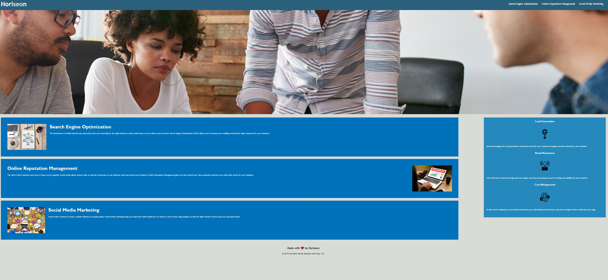

# hw-1
On this homework assigment I worked cleaning up the HTML and CSS code so that it function probably and made it accessible for the client to read.
I began by fixing the header of the website and I then added ATL attribute to all the images and fixed the link to first section by adding an ID to div tag for search engine optimizer.
I then work on the CSS code by condensing multiple seclectors to one line and then rearrange the order of the selctors by the order of the HTML. I then added comments descrirbing some of HTML and CSS code and the change I made on that line of code.

Link to website: https://oechavez18.github.io/hw-1/#social-media-marketing
